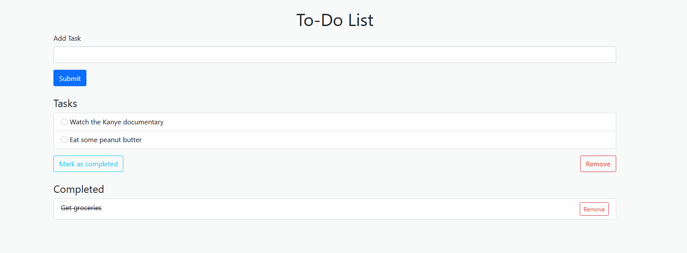

This is just a basic to-do app written with Django (and some HTML and Bootstrap) as an introduction to the framework. I won't be hosting it anywhere, but you can install it with the following steps as long as you have Python 3.8 installed:

### Installation

1. Clone the repository
2. Change directories into the project (set up a virtual environment now if you'd like) and install the requirements:
```
python3 -m pip install requirements.txt
```
3. Create a `.env` file in the current directory, then paste in a newly generated secret key:
```
Python 3.8.10
>>> from django.core.management.utils import get_random_secret_key
>>> print(get_random_secret_key())
```

The `.env` file will look something like this (with your own secret key pasted in):
```
SECRET_KEY = cng#jvv3b1+p4c8el-tfy4@(h4l8(1p1!glod_6&jj2_!5s#4+
```

4. Create database migrations:
```
python3 manage.py makemigrations
python3 manage.py migrate
```
5. Run the server:
```
python3 manage.py runserver
```
Go to https://127.0.0.1:8000 to view the site.